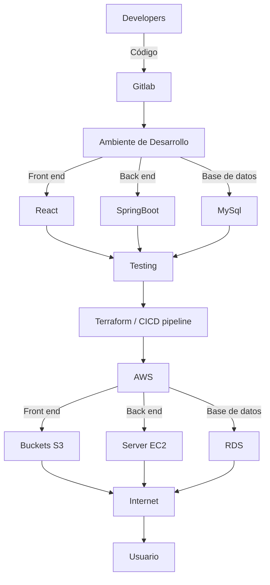

Esta sección tiene como objetivo brindar información de la aplicación desde el punto de vista técnico.
##

- ## Sumario
- [**Ambiente de desarrollo**](#ambiente-de-desarrollo)
    - Instrucciones de cómo un nuevo integrante debería armarse su ambiente de desarrollo
    - Buenas prácticas / convenciones / acuerdos a la hora de desarrollar
    - Uso de GitLab & Branching Strategy Buenas prácticas respecto a los commits, merges y el uso de branches
- [**Base de datos**](#base-de-datos)
    - Estructura y diagramas
    - Scripts / instrucciones para la creación de la base de datos

- [**Componentes y diagramas de la aplicación**](#componentes-y-diagramas-de-la-aplicación)
    - Principales partes de la aplicación y cómo se conectan
    - Swagger APIs disponibles y su documentación (pueden linkear a un sitio externo) 
- [**Infraestructura**](#infraestructura-1)
    - Estructura y diagramas
- [**Testing y calidad**](#testing-y-calidad)
    - Informe final

----

## **Ambiente de Desarrollo**

En esta sección se cubrirán los pasos necesarios para armar los ambientes de las diferentes áreas del proyecto.

### Instrucciones
#### ***Front end***
1. Clonar el repositorio.
2. Verificar que las extensiones detalladas en [Tecnologías](Tecnologias.md) estén instaladas.
3. Correr en consola el comando ***npm install***.
4. Para poder ver la aplicación funcionando, se deberá "buildear" el proyecto. Para hacerlo, se deberá colocar en consola el comando ***npm run build***, y esto generará una carpeta llamada build en el proyecto, y dentro de ella los archivos que deberán publicarse para que el sitio sea visible.

#### ***Back end***
1. Clonar el repositorio, eso traerá archivos y dependencias.
2. En Intellij abrir una aplicación desde fuentes existentes y cargar el archivo **.pom**
3. Verificar que el JDK que se utilice al momento de compilar la aplicación sea **Java 17**.
4. Correr los comandos del Lifecycle de Maven.
5. Esto levantará el ***Back end*** de la aplicación en un servidor local (localhost:8080) y permitirá testear su correcto funcionamiento.

#### **Infraestructura**
La infraestructura del proyecto se montó utilizando AWS (Amazon Web Services). Allí, utilizando una subcuenta dentro de la facilitada por DigitalHouse, creamos una base de datos RDS, se montó un **servidor EC2** y se crearon 2 ***buckets*** **S3**.
Los datos para la creación y conexión a la base de datos se facilitarán en la sección correspondiente.
Para la creación del servidor y buckets se utilizó un script sencillo hecho en Terraform utilizando el concepto de **Infraestructura como Código** ***(IaC)***. Eso permitió lanzar las instancias y llevar un control de versiones de las mismas.
En la instancia EC2 se instaló Java (JDK 17 utilizado en el sitio), Maven, y Git para poder conectar el servidor con nuestro repositorio.

En cuanto a los buckets creados, en uno de ellos se colocaron las imágenes del proyecto y en otro el resultado del build de Front end.

Por inconvenientes la pipeline no está funcional, dado lo cual el deploy se realiza de manera manual. 
Para ello utilizamos la conexión de ssh con el servidor remoto. 
Una vez allí, se creó el servicio de la aplicación llamado servicioapi, ése servicio lo que hace es tomar el archivo SNAPSHOT-O1.jar (es decir el archivo que se genera luego de que se corre el lifecycle de Maven y que compila el *Back end*) de la rama deploybackend (rama utilizada únicamente para hacer el *deploy*) y lo monta. Para ello lo que se hizo fue clonar el repositorio remoto en el servidor y levantar el servicio utilizando los comandos:
- **sudo systemctl status servicio api** (verificar el estado en el momento)
- si estuviera activo, **sudo systemctl stop servicoi api**
- Por último **sudo systemctl start servicio api**. 
- Verificar que la aplicación haya levantado correctamente, una forma sencilla es ingresar a la URL pública de la aplicación y buscar por ejemplo [productos](http://ec2-3-19-211-226.us-east-2.compute.amazonaws.com:8080/producto
). Si todo funciona bien, se debería mostrar el listado en formato Json de los productos.
  
   

#### ***Testing & QA***

[subir](#)

### Buenas prácticas
Dentro de las buenas prácticas a la hora de desarrollar, caben mencionar:
- Más allá de las dailys, los sub equipos que vayan a trabajar sobre la misma parte de la aplicación deben tener comunicación asidua, para poder estar alineados en la lógica que se utilizará a la hora de desarrollar, librerías, conceptos, etc.
- Utilizar convenciones de nombres para las ramas creadas.
- Respetar las normas indiadas para el uso correcto de GitLab.
- Siempre, ante todo, comunicación.
- Comentar el código de manera que los distintos integrantes del equipo puedan fácilmente seguir lo que se está haciendo.
- Al momento de hacer un *Deploy* de la aplicación, tanto desde el *Back end* como desde el *Front end* se generarán archivos, por convención y para evitar conflictos, se utilizan ramas separadas de las de producción.

### Uso de GitLab & Branching Strategy

En cuanto al uso de GitLab, se trabajó con un ambiente de producción en la rama principal (*main*) y uno de desarrollo (*develop*). 
  De la rama de desarrollo y hacia la rama de desarrollo se combinaron y salieron las ramas por caso (*feature-branching*). 
  De la actualización de la rama principal, y a los fines de evitar conflictos, estuvo la persona Analista de Infraestructura.
  Como se mencionara anteriormente, para el *deploy* en la nube de la aplicación, se utilizaron ramas especialmente dedicadas a ése fin.

[subir](#)

----

## **Base de datos**
Para el trabajo con la base de datos, inicialmente se utilizó Workbench, como base local, para luego pasar a utilizar ya la RDS en AWS.

### Estructura y diagramas

[subir](#)
### Scripts / instrucciones para la creación de la base de datos

Para configurar la base de datos desde el Backend, en el archivo appliation.properties configurar:

#### **Si se utiliza RDS en AWS**
spring.jpa.hibernate.ddl-auto=update  
server.port=8080  
spring.datasource.url=jdbc:mysql://db-restore.cnyqegjgetrv.us-east-2.rds.amazonaws.com:3306/0521PTC3N1db_GRUPO5  
spring.datasource.username=***********  
spring.datasource.password=***********  
spring.datasource.driver-class-name =com.mysql.cj.jdbc.Driver  

#### **Si se utiliza una base local**
#spring.datasource.url=jdbc:mysql://${MYSQL_HOST:localhost}:3306/db_prod  
#spring.datasource.username=***********  
#spring.datasource.password=***********  
#spring.datasource.driver-class-name =com.mysql.cj.jdbc.Driver  

En el caso de utilizar una base de datos local, las credenciales deberán ser compartidas para evitar conflictos.

[subir](#)

____
## **Componentes y diagramas de la aplicación**

### Principales partes de la aplicación y cómo se conectan

**Landing page:** esta página muestra siempre 8 imágenes random de hoteles/cabañas/hostels. Esta página permite navegar y realizar búsquedas no estando registrado, pero no permite, sin registro previo, realizar reservas.

 

**Log-in:** cuando el usuario se registra a través de la página, esto impacta generando un nuevo registro en la base de datos. Al completar el formulario de registro, el usuario tendrá permisos automáticamente para realizar reservas. Esta verificación se consigue a través de componentes de seguridad que validarán su condición.

 

**Reservas:** Las reservas pueden realizarse, modificarse, extenderse y cancelarse.
 

**Administrador:** Cuando un usuario se registra como Administrador, puede dar de alta un producto, estipular su precio y atributos.

Cuando un usuario se registra se gestiona automáticamente un permiso (token de autenticación), que permite que se verifique contra la bse de datos su identidad, o se genere un nuevo registro y se permita el ingreso al sitio, habilitándose opciones que de otra manera no tendría.   Caso similar ocurre cuando el usuario es reconocido como Administrador.

  

La verificación de validez de los datos ingresados, en caso de ser un usuario nuevo, se realiza desde el *Front end*.

[subir](#)
#### Swagger APIs disponibles y su documentación

El Swagger de la API puede consultarse [aquí](http://ec2-3-19-211-226.us-east-2.compute.amazonaws.com:8080/swagger-ui/index.html#/).

 
 

____
## **Infraestructura**

Diagrama de Arquitectura de la Infraestructura utilizada.

[subir](#)
____

## **Testing y calidad**
    - [Ver informe Final](InformeTesting.md){:target="_blank"}

[subir](#)